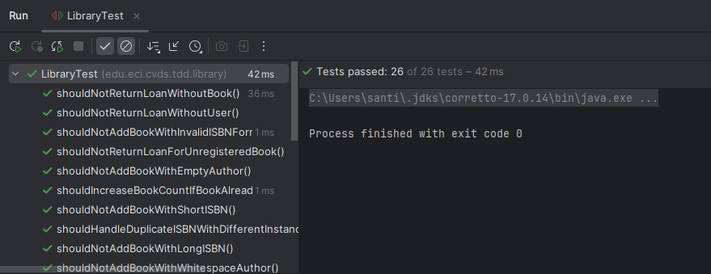
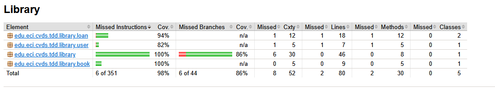
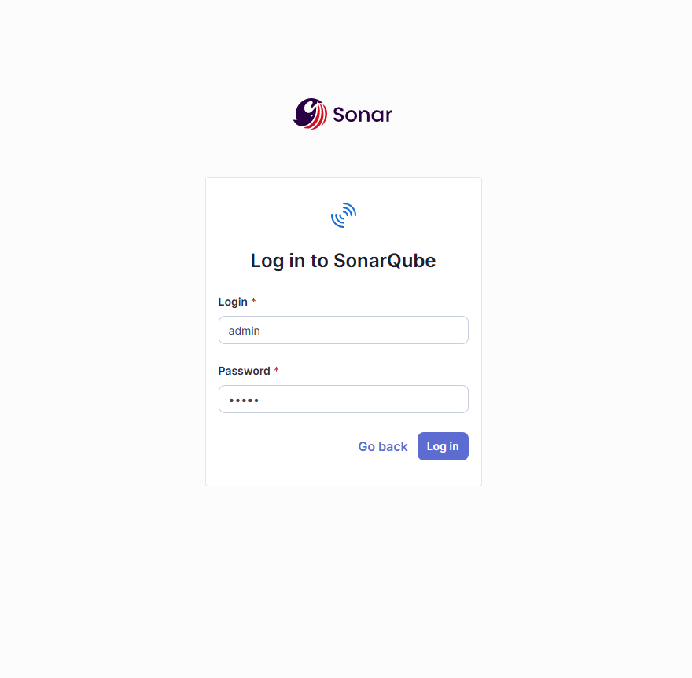
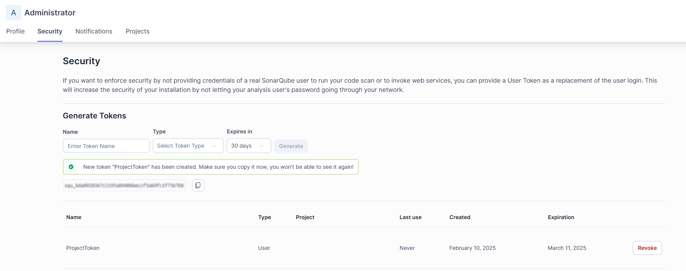
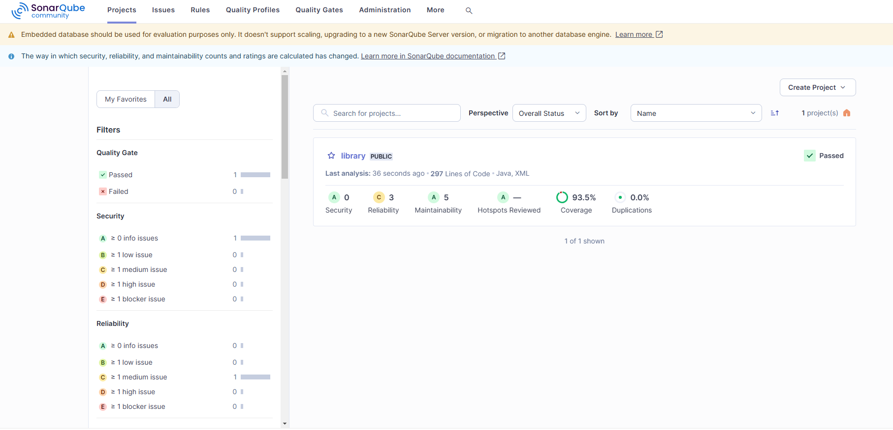
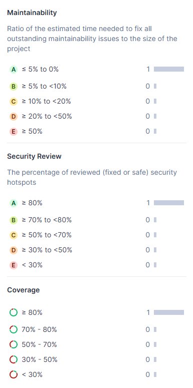

# Library
El propósito de este laboratorio es poner en práctica el desarrollo
guiado por pruebas (TDD). Como primer paso, se leyó la documentación
de cada método a implementar del proyecto "Library", lo que permitió
tener claridad sobre las pruebas que se debían implementar. De
acuerdo con esto, se diseñaron los métodos pertinentes para ofrecer
una solución a estos casos de uso.

Como se ha estado trabajando desde IntelliJ, se ha utilizado
SonarLint para hacer un seguimiento en tiempo real y realizar las
correcciones adecuadas para mantener un estándar. Dado que las
pruebas cumplían con los requisitos mínimos, se implementaron las
integraciones de JaCoCo y SonarQube para realizar el análisis
estático de pruebas. Inicialmente, se generó un reporte de JaCoCo
para analizar la cobertura de pruebas desde el archivo index.html
en el directorio "target/site/jacoco/index.html". Se puede concluir
que la clase de pruebas LibraryTest.java tiene una cobertura del
98% de instrucciones y 86% de ramas en todo el proyecto, superando
el mínimo propuesto del 85%. (Se deja la carpeta "target" en el
repositorio con el propósito de ver la carpeta generada por la
integración de JaCoCo y consultar la documentación de cobertura.)

Posteriormente, para asegurarse del cubrimiento, se ha utilizado la
integración de SonarQube con Docker, iniciando sesión desde
localhost:9000 con el usuario "admin".

Se creó un token de usuario personal con 30 días de expiración con
el propósito de realizar pruebas, el cual posteriormente será
utilizado en el comando mvn verify sonar:sonar -D
sonar.token=[TOKEN_GENERADO]

Una vez que se compila el proyecto Maven, el resultado de las pruebas
se guarda en el dashboard de proyectos de SonarQube en el dominio
localhost:9000, donde se puede analizar que el proyecto Library tuvo
un 93.5% de cobertura, con una alta mantenibilidad, alta seguridad y
una fiabilidad de código media.

## Integrantes
- Ricardo Andres Ayala Garzon - [lRicardol](https://github.com/lRicardol)
- Santiago Botero Garcia - [LePeanutButter](https://github.com/LePeanutButter)